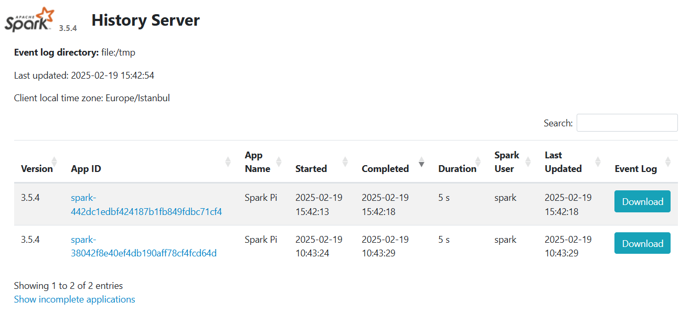

## Prerequisites

- [Spark Operator](../README.md)
- [ServiceAccount, ClusterRole and ClusterRoleBinding](../01-test-basic-app/README.md)


### Create ConfigMap for Spark History Server

This configmap sets spark.history.fs.logDirectory as /tmp folder.

```bash
kubectl apply -f spark-conf-configmap.yaml
```

### Create Spark History Server Deployment

We defined volumes and volumeMounts to map log directory (/tmp folder) to hostPath (/data folder in worker node) we defined.

```bash
kubectl apply -f spark-history-deployment.yaml
```

### Run sparkApplication

To expose history server's 18080 port

```bash
kubectl apply -f spark-pi-with-volume.yaml
```

```
NAME                                    READY   STATUS              RESTARTS   AGE
spark-history-server-546b8b85fb-4w9h6   1/1     Running             0          5h1m
spark-pi-0259b6951e3af155-exec-1        0/1     ContainerCreating   0          0s
spark-pi-with-pvc-driver                1/1     Running             0          4s
```

### Check spark history server UI

