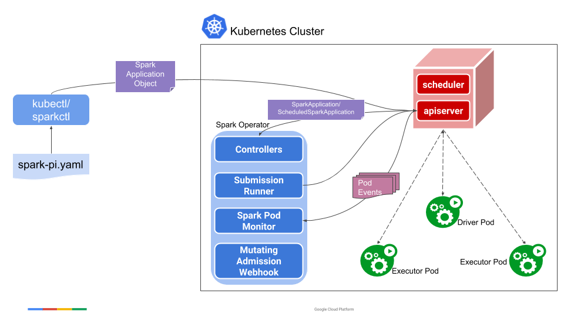

## Architecture

## Summary:

Spark Operator is a Kubernetes Controller designed to manage and run Spark applications.

- A user uses the sparkctl (or kubectl) to create a SparkApplication object. 

- The SparkApplication controller receives the object through a watcher from the API server, creates a submission carrying the spark-submit arguments, and sends the submission to the submission runner. 

- The submission runner submits the application to run and creates the driver pod of the application. Upon starting, the driver pod creates the executor pods. 

- While the application is running, the Spark pod monitor watches the pods of the application and sends status updates of the pods back to the controller, which then updates the status of the application accordingly.
    
## Comparison Table:

| Feature                | YARN                              | Standalone                        | Kubernetes                         |
|------------------------|--------------------------------|--------------------------------|--------------------------------|
| **Driver Failure Handling** | Restarts in **Cluster Mode** if `spark.yarn.maxAppAttempts` is set | Restarts only with `--supervise` | **No automatic restart** unless `OnFailure` is set |
| **Executor Recovery**  | YARN reschedules new executors | Tasks are retried on available executors | Kubernetes reschedules executors, but shuffle data may be lost |
| **Task Retry**         | Tasks are rescheduled up to `spark.task.maxFailures` | Tasks are retried on healthy executors | Similar to YARN, but depends on available executors |
| **Job Resubmission**   | Can be automatically restarted | Needs external retry mechanism | Requires **external retry mechanisms** (e.g., ArgoCD, GitOps) |
| **Shuffle Data Recovery** | Uses external shuffle service, retains shuffle data | Lost if executor crashes | Lost unless using **External Shuffle Service** |
| **Dynamic Executor Allocation** | Yes (`spark.dynamicAllocation.enabled=true`) | No native support | Yes, but needs `spark.dynamicAllocation.enabled` and shuffle service |
| **Application Monitoring** | Integrated with YARN UI & RM logs | Spark Master UI, logs | Uses Prometheus, Spark UI, logs |
| **Use Case**           | Best for Hadoop environments | Suitable for dedicated Spark clusters | Best for cloud-native and containerized workloads |
| **Deployment Complexity** | Medium (requires YARN setup) | Low (simpler setup) | High (requires Spark Operator & Kubernetes setup) |

## Summary
- **YARN**: Best fault tolerance, automatic rescheduling, and better shuffle data recovery.
- **Standalone**: Limited fault tolerance, requires `--supervise` for driver restarts.
- **Kubernetes**: Requires **manual resubmission** for driver failures, but supports **dynamic scaling**.

To improve Kubernetes fault tolerance, consider:
- `restartPolicy: OnFailure` for drivers.
- Using **checkpointing** in Spark Streaming.
- **GitOps tools** (ArgoCD, Flux) to automatically restart failed jobs.

## Resources:

- Spark-submit VS Spark-operator: https://spot.io/blog/setting-up-managing-monitoring-spark-on-kubernetes/

- User guide: https://www.kubeflow.org/docs/components/spark-operator/user-guide/

- Architecture: https://www.kubeflow.org/docs/components/spark-operator/overview/#architecture

- Writing a spark application: https://www.kubeflow.org/docs/components/spark-operator/user-guide/writing-sparkapplication/

- Customizing spark-operator: https://www.kubeflow.org/docs/components/spark-operator/user-guide/customizing-spark-operator/

- Kubeflow helm chart : https://github.com/kubeflow/spark-operator/blob/master/charts/spark-operator-chart/values.yaml

- Mounting a ConfigMap storing Hadoop Configuration Files: https://www.kubeflow.org/docs/components/spark-operator/user-guide/writing-sparkapplication/#mounting-a-configmap-storing-spark-configuration-files